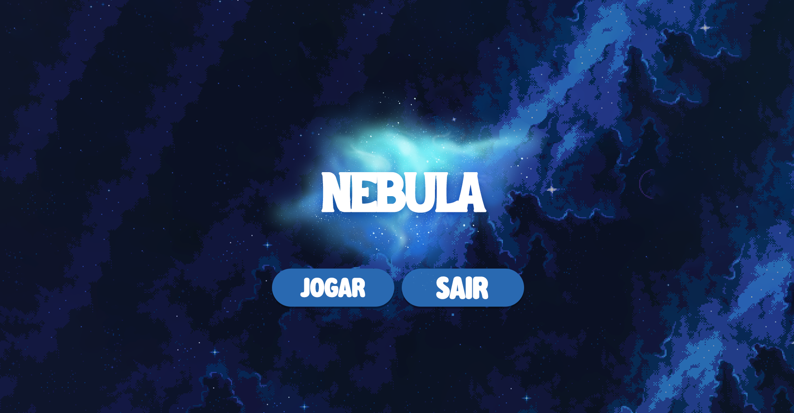

# Nebula

Educational minigame built with Python and Pygame as an academic team project during the SENAI Technical Systems Development course.

<p align="center">
  
</p>

## Overview

Nebula is an educational 2D minigame designed to combine basic game mechanics with introductory Python concepts.

The player can move through the game environment, enter an interaction area and access a dialogue containing questions about Python. Each selected question displays a corresponding educational response.

The project was developed as a team assignment during the SENAI Technical Systems Development course, providing practical experience with Python, Pygame, event handling, sprites and interactive application development.

## Features

- Interactive start menu
- 2D player movement
- Keyboard-based interaction system
- Question-and-answer dialogue
- Mouse-based option selection
- Educational content about Python
- Sprite and image rendering with Pygame
- Frame-rate controlled game loop

## Gameplay

After starting the game from the main menu, the player can navigate through the environment and approach the interaction area.

When the player reaches the interaction zone, pressing `E` opens a list of questions about Python. Questions can then be selected with the mouse, and the corresponding answer is displayed in the game.

The dialogue includes topics such as Python applications, common use cases, mathematical operations and game development.

## Tech Stack

- **Python** — game logic and application structure
- **Pygame** — graphics, sprites, input handling and game loop

## Project Structure

```text
nebula/
├── data/
│   ├── command_center.png
│   ├── command_room.png
│   ├── menu.png
│   └── player.png
├── docs/
│   └── nebula-preview.png
├── src/
│   ├── __init__.py
│   ├── config.py
│   ├── game.py
│   ├── player.py
│   └── responses.py
├── .gitignore
├── README.md
├── README.pt-BR.md
└── requirements.txt
```

## Getting Started

### Requirements

- Python
- pip

### Clone the repository

```bash
git clone https://github.com/arthurcfranklin/nebula.git
cd nebula
```

### Create a virtual environment

Linux/macOS:

```bash
python -m venv .venv
source .venv/bin/activate
```

Windows:

```powershell
python -m venv .venv
.venv\Scripts\Activate.ps1
```

### Install the dependencies

```bash
python -m pip install -r requirements.txt
```

### Run the game

```bash
python -m src.game
```

## Controls

| Input | Action |
| --- | --- |
| `W` `A` `S` `D` | Move the player |
| `E` | Interact when inside the interaction area |
| Mouse | Select dialogue options |

## Academic Context

Nebula was developed as an academic team project during the SENAI Technical Systems Development course.

The project provided practical experience with Python and Pygame while exploring fundamental concepts such as object-oriented programming, event handling, player movement, sprites, proximity-based interaction and interactive user interfaces.

## Team

Nebula was developed collaboratively as a student project.

- Arthur Franklin
- Bruno Lopes
- David

---

Developed as an academic project · [Português](README.pt-BR.md)
